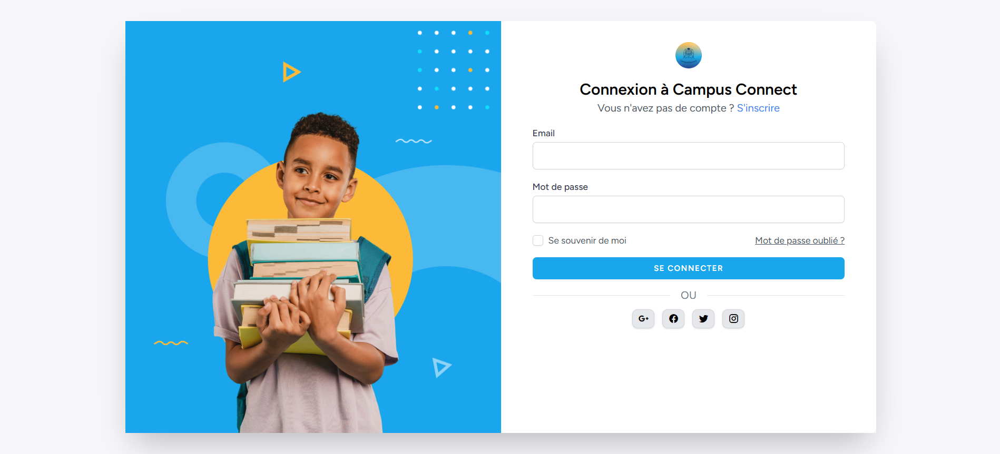
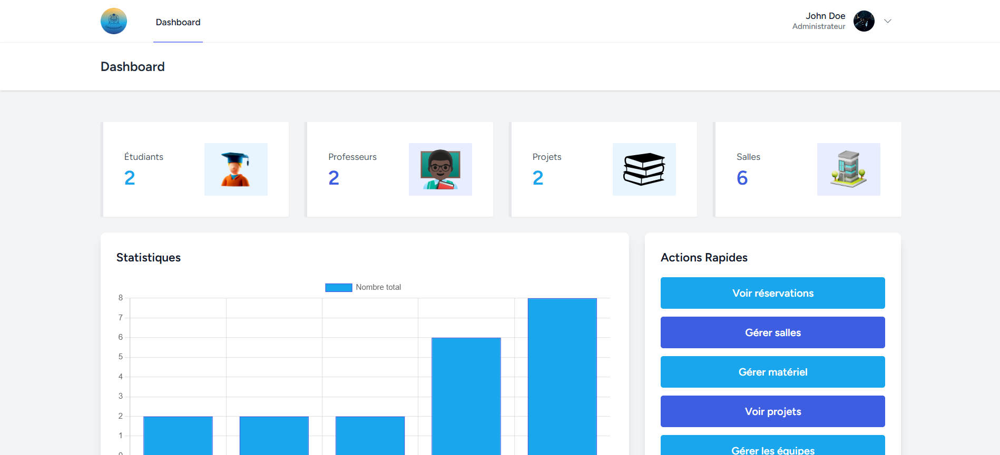
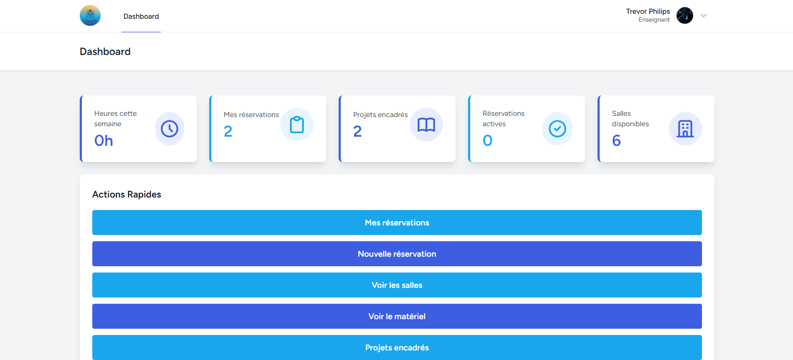
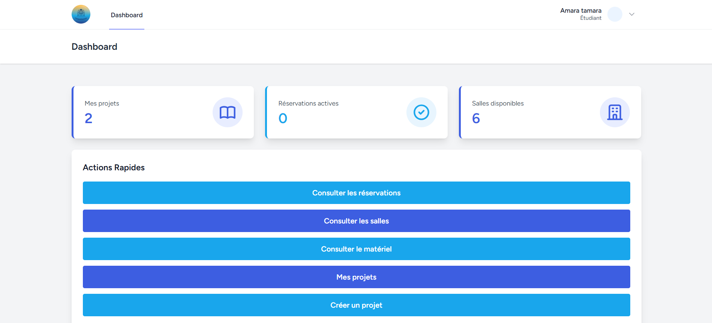

# CampusConnect — Portail universitaire

[](https://laravel.com)
[](https://php.net)
[](https://mysql.com)
[](https://vitejs.dev)

Portail interne universitaire **CampusConnect** : réservation de salles et de matériel, gestion de projets étudiants, équipes et livrables. Interface par rôle (Administrateur, Enseignant, Étudiant).

---

## Accès de test (back-office)

Après `php artisan db:seed`, un compte administrateur est créé pour accéder au tableau de bord :

| | Valeur |
|---|--------|
| **URL connexion** | http://localhost:8000/login |
| **Email** | `test@example.com` |
| **Mot de passe** | `password` |

  
*Écran de connexion au portail.*

  
*Tableau de bord administrateur.*

  
*Tableau de bord enseignant.*

  
*Tableau de bord étudiant.*

---

## Stack

- **Backend** : Laravel 12
- **Base de données** : MySQL
- **Auth** : Laravel Jetstream (Livewire) + Sanctum
- **Frontend** : Blade, Livewire, Tailwind CSS, Vite

---

## Fonctionnalités principales

- **Réservation** : salles et matériel (créneaux, approbation/rejet par l’admin)
- **Projets étudiants** : création, équipes, rejoindre/quitter, statistiques
- **Livrables** : dépôt et gestion par projet
- **Rôles** : Administrateur (gestion complète), Enseignant, Étudiant (tableaux de bord et actions adaptés)

---

## Installation locale

**Prérequis** : PHP >= 8.2, Composer, MySQL >= 5.7, Node.js >= 18

```bash
git clone https://github.com/iamrachking/CampusConnect.git
cd CampusConnect
composer install
npm install
cp .env.example .env
php artisan key:generate
```

Configurer la base dans `.env` (par ex. `DB_DATABASE=campusconnect`, `DB_USERNAME`, `DB_PASSWORD`), puis :

```bash
php artisan migrate
php artisan db:seed
npm run build
php artisan serve
```

- **Portail** : http://localhost:8000 (connexion avec le compte admin ci-dessus)

Pour le développement avec rechargement à chaud (serveur + queue + Vite) :

```bash
composer run dev
```

---

## Structure des rôles

| Rôle | Droits principaux |
|------|-------------------|
| **Administrateur** | Salles/matériel (CRUD), approbation réservations, gestion globale |
| **Enseignant** | Projets (encadrement), réservations, tableau de bord enseignant |
| **Étudiant** | Réservations, projets (rejoindre/équipes), livrables, tableau de bord étudiant |

