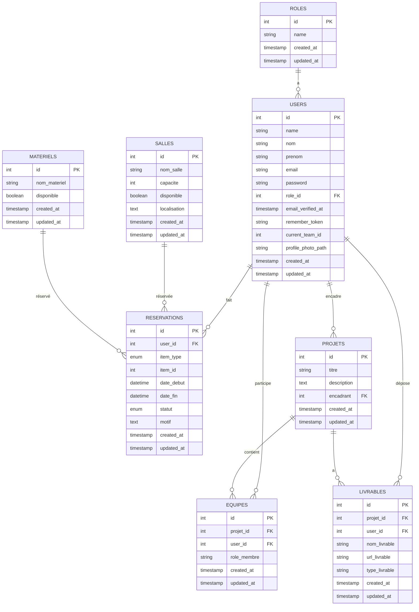

# Diagramme de la Base de Données CampusConnect

## Légende des Relations

- **ROLES → USERS** : Un rôle peut avoir plusieurs utilisateurs
- **USERS → RESERVATIONS** : Un utilisateur peut faire plusieurs réservations
- **USERS → PROJETS** : Un utilisateur peut encadrer plusieurs projets
- **USERS → EQUIPES** : Un utilisateur peut participer à plusieurs équipes
- **USERS → LIVRABLES** : Un utilisateur peut déposer plusieurs livrables
- **PROJETS → EQUIPES** : Un projet peut avoir plusieurs équipes
- **PROJETS → LIVRABLES** : Un projet peut avoir plusieurs livrables
- **SALLES → RESERVATIONS** : Une salle peut être réservée plusieurs fois
- **MATERIELS → RESERVATIONS** : Un matériel peut être réservé plusieurs fois

## Types de Relations

1. **One-to-Many** : La plupart des relations sont de type 1:N
2. **Polymorphe** : Les réservations peuvent concerner soit des salles soit des matériels
3. **Many-to-Many** : Les utilisateurs et projets sont liés via la table équipes
